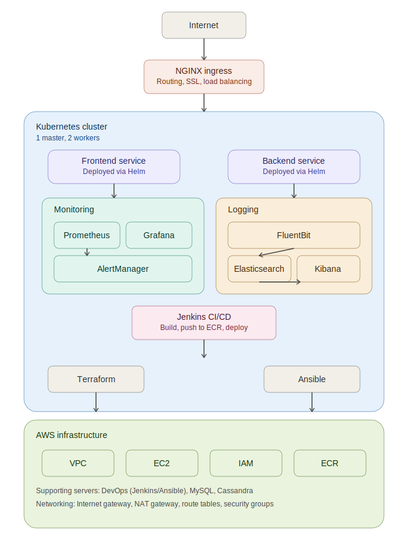
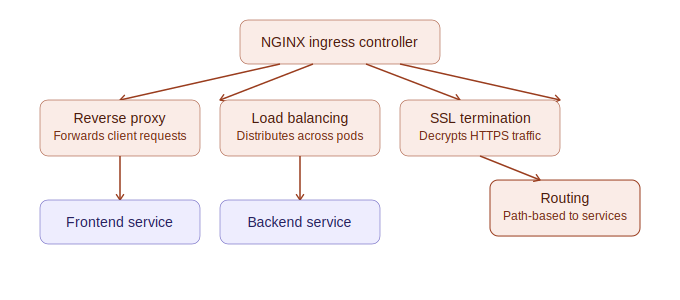
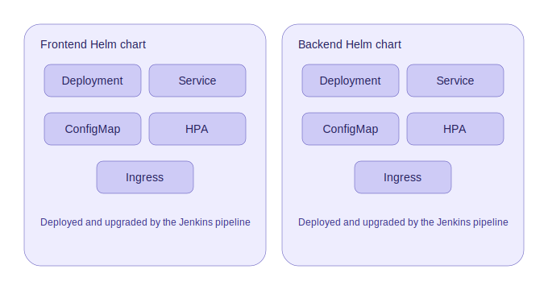
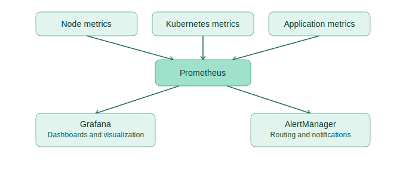
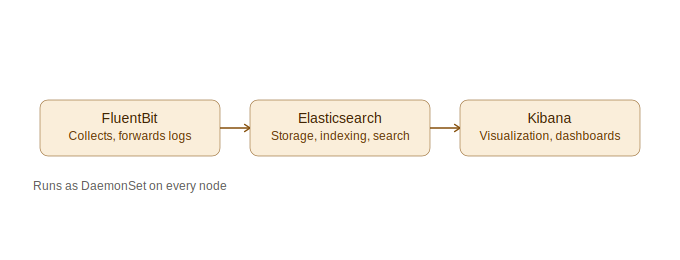
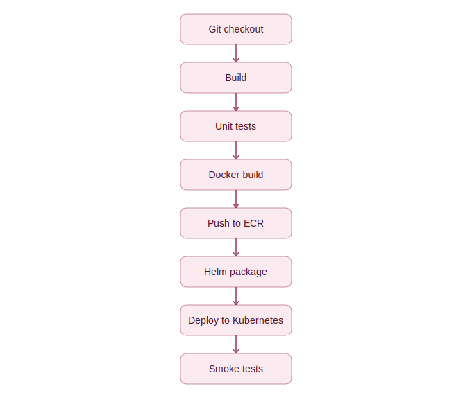
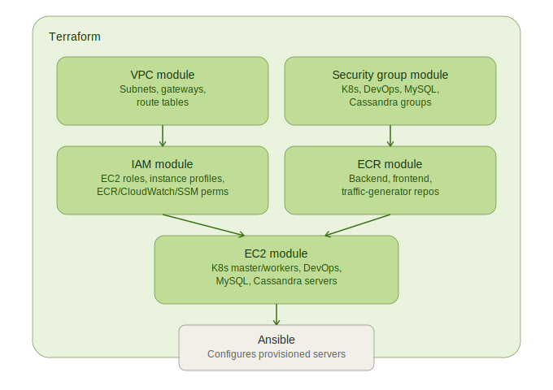
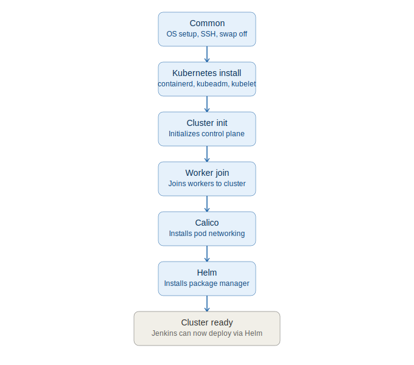

# Indian University Platform

### End-to-End Cloud Native University Management Platform on AWS

---

## Project Overview

Indian University Platform is a complete end-to-end cloud native microservices platform designed to demonstrate enterprise-grade DevOps, Cloud Architecture, Kubernetes, Infrastructure as Code, Observability, CI/CD, and Automation practices.

The project simulates a real-world university management ecosystem and showcases how modern applications are built, deployed, monitored, and managed using AWS and Kubernetes.

This project was built as a portfolio and learning platform to demonstrate skills expected from:

- Cloud Architect
- Solution Architect
- DevOps Engineer
- Platform Engineer
- Site Reliability Engineer
- Kubernetes Administrator

---

## Project Objectives

- Build enterprise-grade cloud infrastructure on AWS
- Implement Infrastructure as Code using Terraform
- Implement Configuration Management using Ansible
- Build and manage Kubernetes clusters from scratch
- Implement CI/CD pipelines
- Implement observability and monitoring
- Implement centralized logging
- Deploy microservices using Helm
- Demonstrate production-grade cloud architecture concepts
- Automate the entire platform deployment lifecycle

---

## High-Level Architecture



Traffic enters through the NGINX ingress, is routed to the frontend and backend services running inside the Kubernetes cluster, which also hosts the monitoring (Prometheus, Grafana, AlertManager) and logging (FluentBit, Elasticsearch, Kibana) stacks. The cluster itself runs on AWS infrastructure (VPC, EC2, IAM, ECR) provisioned by Terraform and configured by Ansible, with Jenkins handling continuous integration and delivery into the cluster.

---

## Detailed Component Architecture

### 1. NGINX Ingress Layer



The ingress controller is the single entry point for all external traffic and performs four functions before a request reaches a pod:

| Function | Description |
|---|---|
| SSL termination | Decrypts incoming HTTPS traffic at the edge |
| Reverse proxy | Forwards client requests into the cluster |
| Load balancing | Distributes traffic across healthy pod replicas |
| Routing | Applies path-based rules to send traffic to the frontend or backend service |

Flow: `Internet → SSL termination → Reverse proxy → Load balancing → Routing → Frontend / Backend service`

### 2. Frontend & Backend Services (Helm Charts)



Both services are packaged and deployed as Helm charts with an identical resource layout:

| Resource | Purpose |
|---|---|
| Deployment | Manages the running pod replicas |
| Service | Exposes pods on a stable internal address |
| ConfigMap | Stores application configuration |
| HPA (HorizontalPodAutoscaler) | Scales pod replicas based on load |
| Ingress | Registers routing rules with the NGINX ingress controller |

Both charts are deployed and upgraded automatically by the Jenkins pipeline.

### 3. Monitoring Stack



- **Prometheus** scrapes node-level, Kubernetes-level, and application-level metrics into a single time-series store.
- **Grafana** reads from Prometheus to render dashboards, visualizations, and alert views.
- **AlertManager** evaluates alerting rules and handles routing and notifications.

### 4. Logging Stack



FluentBit runs as a DaemonSet on every node, tailing container logs, forwarding and transforming them. Elasticsearch stores and indexes the log data, and Kibana queries that index to provide searchable dashboards.

### 5. CI/CD Pipeline (Jenkins)



A linear pipeline runs on every change:

1. **Git checkout** — pulls the latest source code
2. **Build** — compiles / prepares the application
3. **Unit tests** — gates the build on passing tests
4. **Docker build** — containerizes frontend and backend images
5. **Push to ECR** — publishes images to the AWS container registry
6. **Helm package** — packages the updated Helm chart
7. **Deploy to Kubernetes** — applies the chart to the cluster
8. **Smoke tests** — verifies the deployment is healthy

### 6. Terraform Modules (Infrastructure Provisioning)



| Module | Creates |
|---|---|
| VPC module | VPC, public/private subnets, internet gateway, NAT gateway, route tables |
| Security group module | Kubernetes, DevOps, MySQL, and Cassandra security groups |
| IAM module | EC2 roles, instance profiles, ECR/CloudWatch/SSM permissions |
| ECR module | Backend, frontend, and traffic-generator repositories |
| EC2 module | Kubernetes master/workers, DevOps server, MySQL server, Cassandra server |

Execution order: the **VPC** and **security group** modules establish networking and firewall boundaries first → **IAM** and **ECR** set up permissions and the registry → the **EC2** module provisions the actual instances using those roles and security groups → **Ansible** then configures the provisioned servers.

### 7. Ansible Playbooks (Configuration Management)



Run in sequence to turn raw EC2 instances into a working cluster:

1. **Common** (`common.yaml`) — OS updates, utilities, SSH config, disables SELinux/swap
2. **Kubernetes install** (`kubernetes.yaml`) — containerd, kernel modules, sysctl, kubeadm, kubelet, kubectl
3. **Cluster init** (`k8s-init.yaml`) — initializes the control plane, configures kubeconfig, generates join token
4. **Worker join** (`k8s-join.yaml`) — joins worker nodes to the cluster
5. **Calico** (`calico.yaml`) — installs pod networking
6. **Helm** (`helm.yaml`) — installs the Helm package manager

Once complete, the cluster is ready and Jenkins can deploy services via Helm.

### 8. AWS Infrastructure

| Service | Purpose |
|---|---|
| EC2 | Compute instances (Kubernetes master/workers, DevOps, MySQL, Cassandra) |
| VPC | Network isolation |
| IAM | Identity management |
| Security Groups | Firewall rules |
| ECR | Container registry |
| CloudWatch | Monitoring |
| Route Tables | Networking |
| Internet Gateway | Internet access |
| NAT Gateway | Private subnet access |
| Elastic IP | Static public IP |

**Kubernetes cluster nodes:**

| Node | Type | Purpose |
|---|---|---|
| Master | EC2 | Kubernetes control plane |
| Worker-1 | EC2 | Application workloads |
| Worker-2 | EC2 | Application workloads |

**Supporting infrastructure:**

| Server | Purpose |
|---|---|
| DevOps Server | Jenkins, Ansible |
| MySQL Server | Relational database |
| Cassandra Server | NoSQL database |

---

## Project Structure

```
Indian-University/

├── Terraform/
│   ├── environments/
│   │   └── dev/
│   └── modules/
│       ├── vpc/
│       ├── ec2/
│       ├── security-groups/
│       ├── iam/
│       └── ecr/
│
├── Ansible/
│   ├── inventories/
│   ├── playbooks/
│   └── roles/
│
├── frontend/
│
├── backend/
│
├── database/
│
├── helm/
│   ├── frontend/
│   └── backend/
│
├── docker/
│
├── jenkins/
│
├── docs/
│
└── README.md
```

---

## Kubernetes Architecture

### Control Plane
- API Server
- Scheduler
- Controller Manager
- etcd

### Worker Nodes
- kubelet
- kube-proxy
- containerd

---

## Containerization

```bash
# Frontend
docker build -t frontend .

# Backend
docker build -t backend .
```

### AWS ECR Repositories
- `university-frontend`
- `university-backend`
- `traffic-generator`

---

## Observability

The platform implements the three pillars of observability:

| Pillar | Tools |
|---|---|
| Metrics | Prometheus, Grafana |
| Logs | FluentBit, Elasticsearch, Kibana |
| Monitoring/Alerting | AlertManager, CloudWatch |

---

## Security Features

- IAM Roles
- Security Groups
- Kubernetes RBAC
- Namespace isolation
- SSH key authentication
- Private networking
- Container image scanning

---

## Validation

**Infrastructure validation**
```bash
terraform validate
terraform plan
terraform apply
```

**Ansible validation**
```bash
ansible all -m ping
ansible-playbook --syntax-check
```

**Kubernetes validation**
```bash
kubectl get nodes
kubectl get pods -A
kubectl cluster-info
```

---

## Cost Optimization

- Spot instances
- Smaller instance types
- Resource limits and requests
- Cluster consolidation
- Auto scaling
- Monitoring resource consumption

---

## Future Enhancements

- ArgoCD / GitOps
- Service Mesh (Istio)
- HPA / VPA / Cluster Autoscaler
- AWS EBS CSI / OpenEBS / persistent volumes
- Kafka
- OpenTelemetry / Jaeger
- AI observability
- Security scanning
- Disaster recovery

---

## Technologies Used

| Category | Technologies |
|---|---|
| Cloud | AWS |
| Infrastructure | Terraform, Ansible |
| Containers | Docker, Kubernetes, Helm |
| CI/CD | Jenkins, GitHub |
| Monitoring | Prometheus, Grafana, AlertManager |
| Logging | Elasticsearch, Kibana, FluentBit |
| Databases | MySQL, Cassandra |
| Programming | Python, JavaScript, Bash |

---

## Key Skills Demonstrated

Cloud Architecture, Solution Architecture, AWS, Terraform, Infrastructure as Code, Ansible, Kubernetes, Docker, Helm, Jenkins, CI/CD, DevOps, SRE, Observability, Monitoring, Logging, Security, Automation, Networking, Linux Administration

---

## Author

**Ravi Shekhar Reddy**
Technical Architect | Cloud Architect | DevOps Engineer

**Focus Areas:** AWS Cloud, Kubernetes, DevOps, Platform Engineering, Observability, Automation, Cloud Architecture

---

## Project Outcome

This project demonstrates the complete lifecycle of building and managing a cloud-native enterprise platform including infrastructure provisioning, configuration management, container orchestration, continuous integration, continuous deployment, monitoring, logging, observability, security, and automation.

---

## Code Review & Fixes

This codebase went through a full security and functionality review. See **[FIXES.md](FIXES.md)** for the complete list of issues found and how each was resolved (authentication bypass, hardcoded credentials, broken builds, over-permissive security groups/IAM, and more), plus a short list of values you still need to supply yourself (secrets, AWS account ID, etc.) before deploying.
